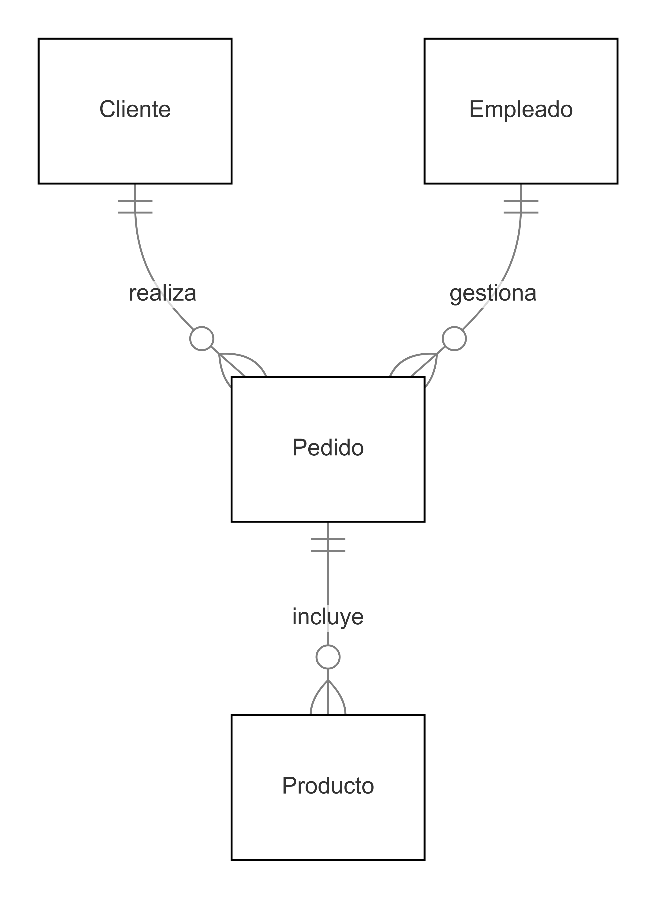
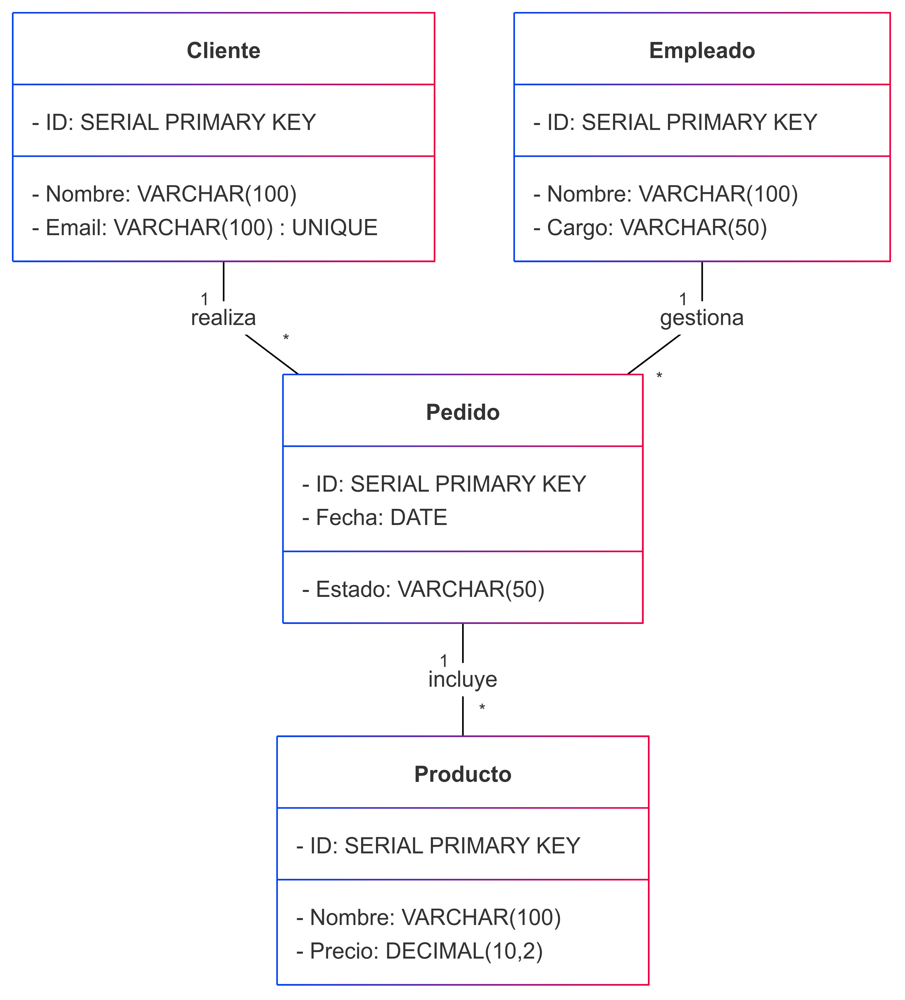

# Diseño de Bases de Datos con el Modelo E-R

----

## Contenido

1. El Proceso de Diseño
2. Modelo Entidad-Relación
3. Diseño con diagramas E-R
4. Modelo E-R extendido
5. La Notación E-R con UML
6. Caso de estudio: Sistema de Gestión de Ventas

---

# 2.1 El Proceso de Diseño

---

## Recolección de Requisitos

Identificación de datos y operaciones en el **Sistema de Gestión de Ventas**

- **Datos Clave**:
  - Cliente: ID, Nombre, Email, Teléfono
  - Producto: ID, Nombre, Precio, Categoría
  - Pedido: ID, Fecha, Cliente, Estado
  - Empleado: ID, Nombre, Cargo

---

- **Operaciones Principales**:
  - Un cliente puede **realizar múltiples pedidos**.
  - Un pedido puede **incluir múltiples productos**.
  - Un empleado puede **gestionar pedidos**.

---

## 2. Modelado Conceptual

### Creación del diagrama E-R

- Representación de **entidades** (Cliente, Producto, Pedido, Empleado).
- Definición de **relaciones**:
  - Cliente **realiza** Pedido.
  - Pedido **contiene** Producto.
  - Empleado **gestiona** Pedido.

---

Ejemplo de representación gráfica:



---



---

## 3. Modelado Lógico

---

### Conversión del modelo conceptual a tablas

- **Entidad Cliente**:

  ```sql
  CREATE TABLE Cliente (
      ID SERIAL PRIMARY KEY,
      Nombre VARCHAR(100) NOT NULL,
      Email VARCHAR(100) UNIQUE NOT NULL,
      Telefono VARCHAR(20)
  );

---

- **Entidad Producto**:

  ```sql
  CREATE TABLE Producto (
      ID SERIAL PRIMARY KEY,
      Nombre VARCHAR(100) NOT NULL,
      Precio DECIMAL(10,2) NOT NULL,
      Categoria VARCHAR(50)
  );


---

- **Entidad Pedido**:
  
  ```sql
  CREATE TABLE Pedido (
      ID SERIAL PRIMARY KEY,
      Fecha DATE NOT NULL,
      Cliente_ID INT NOT NULL,
      Estado VARCHAR(50) NOT NULL,
      FOREIGN KEY (Cliente_ID) REFERENCES Cliente(ID)
  );
  ```

---

- **Entidad Intermedia detalle_Producto_pedido**:

  ```sql
  CREATE TABLE detalle_Producto_pedido (
      ID SERIAL PRIMARY KEY,
      Pedido_ID INT NOT NULL,
      Producto_ID INT NOT NULL,
      Cantidad INT NOT NULL,
      FOREIGN KEY (Pedido_ID) REFERENCES Pedido(ID),
      FOREIGN KEY (Producto_ID) REFERENCES Producto(ID)
  );
  ```

---

## 4. Modelado Físico

### Implementación en un SGBD

- **Selección del sistema de gestión de bases de datos (SGBD)**:
  - Se elige **PostgreSQL** por su robustez y escalabilidad.
  
---

- **Creación de índices para mejorar el rendimiento**:

  ```sql
  CREATE INDEX idx_cliente_email ON Cliente(Email);
  CREATE INDEX idx_pedido_fecha ON Pedido(Fecha);
  ```

---

## 5. Normalización

### Eliminación de **redundancias** y optimización

- **Aplicación de las formas normales:**
  - **1FN:** Asegurar que cada campo contiene un solo valor atómico.
  - **2FN:** Eliminar dependencias parciales.
  - **3FN:** Eliminar dependencias transitivas.

---

## 6. Caso de Estudio: Sistema de Gestión de Ventas

Descripción

Una tienda en línea necesita una base de datos para gestionar clientes, productos y pedidos.

---

### Entidades y Relaciones

- **Cliente realiza pedidos**.
- **Pedido contiene productos**.
- **Empleado gestiona pedidos**.