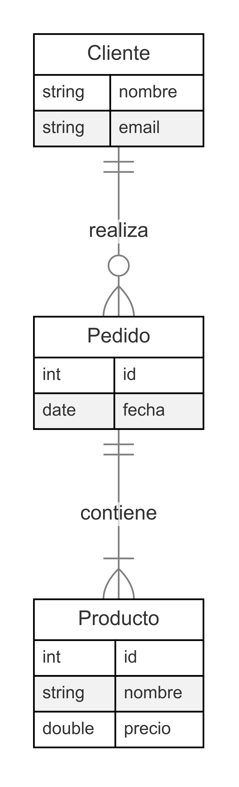
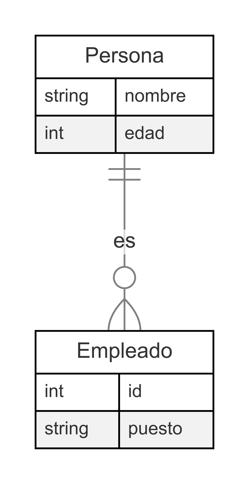
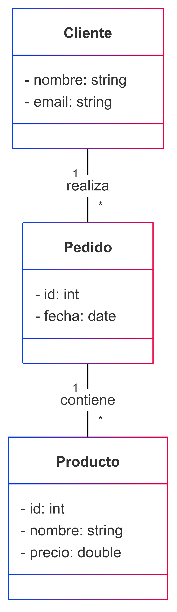

# **Diseño de Bases de Datos con el Modelo E-R**

## **Principios Fundamentales**

---

# **2.1 El Proceso de Diseño**

✅ Definir requisitos de información.  
✅ Identificar entidades y relaciones clave.  
✅ Establecer restricciones y reglas de negocio.  
✅ Normalizar para evitar redundancia y mejorar consistencia.  
✅ Validar con usuarios y ajustar si es necesario.  

---

# **2.2 Modelo Entidad-Relación**

🛠 **Definición**: Representación gráfica de datos y relaciones.  
📌 **Componentes**:  

- **Entidades**: Objetos principales del sistema.  
- **Atributos**: Características de las entidades.  
- **Relaciones**: Asociaciones entre entidades.  
- **Cardinalidad**: Número de ocurrencias en la relación.  

---

# **2.3 Diseño con Diagramas E-R**

---

🖼 **Ejemplo de Diagrama E-R**



---

# **2.4 Modelo E-R Extendido**

🚀 **Extensiones del Modelo E-R**:  
✅ **Especialización y Generalización**  
✅ **Atributos derivados y multivaluados**  
✅ **Herencia de entidades**  
✅ **Relaciones ternarias y n-arias**  

---

# 📌 **Ejemplo**: Relación entre empleados y departamentos con herencia  

---



---

📌 **Ejemplo de SQL**

```sql
CREATE TABLE Persona (
    id INT AUTO_INCREMENT PRIMARY KEY,
    nombre VARCHAR(100) NOT NULL,
    edad INT NOT NULL
);

CREATE TABLE Empleado (
    id INT PRIMARY KEY,
    puesto VARCHAR(100) NOT NULL,
    FOREIGN KEY (id) REFERENCES Persona(id) ON DELETE CASCADE
);
```

---

# **2.5 La Notación E-R con UML**

📌 **Diferencias con el modelo clásico**:  
✅ UML usa **clases y asociaciones** en lugar de entidades y relaciones.  
✅ Representa **multiplicidad** en lugar de cardinalidad.  
✅ **Diagrama de clases** puede modelar estructuras de bases de datos.  

---

# 🖼  **Ejemplo UML y query SQL**

---


---

```sql
CREATE TABLE Cliente (
    id INT AUTO_INCREMENT PRIMARY KEY,
    nombre VARCHAR(255) NOT NULL,
    email VARCHAR(255) NOT NULL UNIQUE
);

CREATE TABLE Pedido (
    id INT AUTO_INCREMENT PRIMARY KEY,
    fecha DATE NOT NULL,
    cliente_id INT,
    FOREIGN KEY (cliente_id) REFERENCES Cliente(id)
);

CREATE TABLE Producto (
    id INT AUTO_INCREMENT PRIMARY KEY,
    nombre VARCHAR(255) NOT NULL,
    precio DOUBLE NOT NULL
);

CREATE TABLE Pedido_Producto (
    pedido_id INT,
    producto_id INT,
    cantidad INT NOT NULL,
    PRIMARY KEY (pedido_id, producto_id),
    FOREIGN KEY (pedido_id) REFERENCES Pedido(id),
    FOREIGN KEY (producto_id) REFERENCES Producto(id)
);
```

---

# Tareas 📌

---

1️⃣ Sistema de Reservas de Hotel 🏨
📌 Requerimientos:

Los clientes deben poder reservar habitaciones.
Cada reserva debe registrar fechas de check-in y check-out.
Se debe almacenar información del cliente y del pago.
✅ Prácticas a aplicar:

Identificar entidades: Clientes, Reservas, Habitaciones, Pagos.
Definir reglas de negocio: No permitir dos reservas para la misma habitación en la misma fecha.
Aplicar normalización para evitar redundancia en los datos de los clientes.

---

2️⃣ Plataforma de Comercio Electrónico 🛒
📌 Requerimientos:

Los clientes pueden hacer pedidos y agregar múltiples productos.
Se necesita historial de compras y facturación.
Gestión de stock de productos.
✅ Prácticas a aplicar:

Crear entidades: Usuarios, Pedidos, Productos, DetallePedido.
Restricción: No permitir pedidos con stock insuficiente.
Normalizar para evitar repetir datos del cliente en cada pedido.

---

3️⃣ Sistema de Gestión Escolar 🎓
📌 Requerimientos:

Alumnos se inscriben en cursos.
Profesores imparten múltiples materias.
Registrar calificaciones de los alumnos.
✅ Prácticas a aplicar:

Identificar entidades: Alumnos, Cursos, Profesores, Inscripciones, Calificaciones.
Reglas de negocio: Un alumno no puede inscribirse en el mismo curso dos veces.
Implementar seguridad para restringir acceso a notas.

---

4️⃣ Aplicación de Mensajería 📩
📌 Requerimientos:

Los usuarios pueden enviarse mensajes entre sí.
Mensajes pueden incluir archivos adjuntos.
Se debe almacenar el historial de conversaciones.
✅ Prácticas a aplicar:

Definir entidades: Usuarios, Mensajes, Adjuntos.
Restricción: Un mensaje solo puede enviarse a usuarios registrados.
Índices en la base de datos para búsquedas rápidas en el historial.

---

5️⃣ Plataforma de Streaming de Música 🎵
📌 Requerimientos:

Usuarios pueden crear playlists con canciones.
Artistas pueden subir canciones.
Se debe almacenar historial de reproducción.
✅ Prácticas a aplicar:

Crear entidades: Usuarios, Canciones, Playlists, HistorialReproducción.
Restricción: Una playlist solo puede pertenecer a un usuario.
Implementar seguridad para evitar acceso no autorizado.

---

6️⃣ Sistema de Gestión de Citas Médicas 🏥
📌 Requerimientos:

Los pacientes pueden agendar citas con médicos.
Cada cita debe tener fecha, hora y estado (pendiente, atendida, cancelada).
Los médicos pueden tener horarios específicos.
✅ Prácticas a aplicar:

Identificar entidades: Pacientes, Médicos, Citas, Especialidades.
Restricción: No permitir citas duplicadas en el mismo horario.
Normalizar datos para evitar redundancia en la información del paciente.

---

7️⃣ Biblioteca Digital 📚
📌 Requerimientos:

Usuarios pueden tomar libros en préstamo.
Se debe registrar la fecha de devolución esperada.
Solo ciertos usuarios pueden administrar libros.
✅ Prácticas a aplicar:

Definir entidades: Usuarios, Libros, Préstamos.
Restricción: No permitir más de 3 libros en préstamo por usuario.
Seguridad para evitar acceso no autorizado a la administración.

---

8️⃣ Sistema de Gestión de Proyectos 📊
📌 Requerimientos:

Empresas pueden registrar proyectos.
Cada proyecto tiene múltiples tareas y responsables.
Se deben registrar avances en las tareas.
✅ Prácticas a aplicar:

Crear entidades: Empresas, Proyectos, Tareas, Usuarios.
Restricción: Un usuario solo puede trabajar en proyectos de su empresa.
Normalización para almacenar comentarios sin repetir información.

---

9️⃣ Red Social 📱
📌 Requerimientos:

Los usuarios pueden hacer publicaciones y reaccionar a ellas.
Se debe almacenar el historial de interacciones.
Usuarios pueden seguir a otros usuarios.
✅ Prácticas a aplicar:

Entidades clave: Usuarios, Publicaciones, Comentarios, Reacciones.
Restricción: No permitir que un usuario se siga a sí mismo.
Índices para mejorar la velocidad de búsqueda en el historial.

---

🔟 Sistema de Facturación 💵
📌 Requerimientos:

Generar facturas a clientes por productos comprados.
Registrar impuestos y descuentos.
Cada factura debe estar asociada a un cliente.
✅ Prácticas a aplicar:

Entidades clave: Clientes, Facturas, DetalleFactura, Productos.
Restricción: No permitir facturas sin detalles de compra.
Normalización para evitar duplicidad de información.