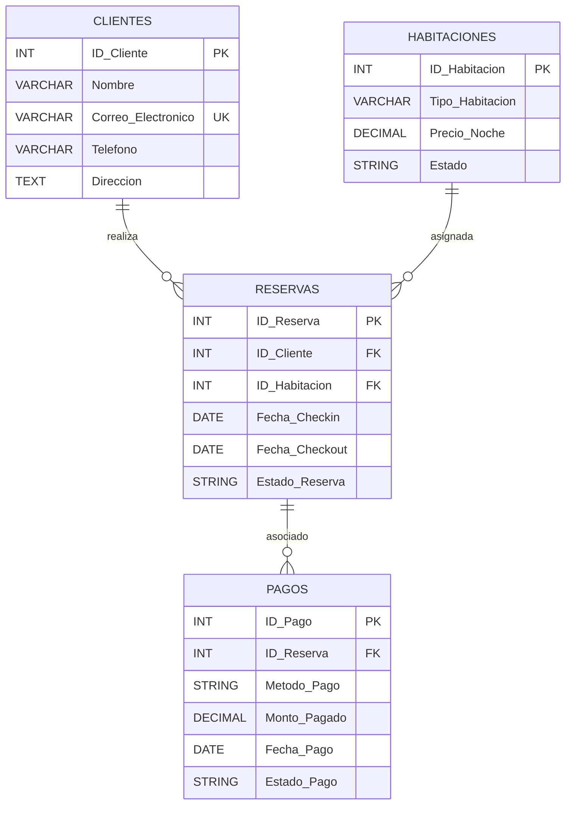

# Creación de Diagramas de Modelo Relacional

## ¿Qué es un Diagrama Entidad-Relación (ERD)?

- Representa visualmente la estructura de una base de datos.
- Define entidades, atributos y relaciones.
- Ayuda a diseñar bases de datos normalizadas.

---

## Elementos Claves de un ERD

- **Entidades**: Representan objetos del mundo real (Ej: Clientes, Reservas).
- **Atributos**: Propiedades de cada entidad (Ej: Nombre, Correo Electrónico).
- **Relaciones**: Conectan entidades (Ej: Un Cliente realiza Reservas).
- **Clave Primaria (PK)**: Identificador único de una entidad.
- **Clave Foránea (FK)**: Referencia a otra entidad.

---

## Ejemplo de Diagrama ERD

---

---

---

## Explicación del Ejemplo

1. **Clientes** pueden realizar múltiples **Reservas**.
2. Cada **Reserva** está asociada a una **Habitación**.
3. Cada **Reserva** tiene un **Pago** asociado.
4. Las claves primarias (PK) identifican registros únicos.
5. Las claves foráneas (FK) mantienen la integridad referencial.

---

## Beneficios de un ERD

✅ Facilita la comprensión de la base de datos.
✅ Ayuda a evitar redundancia y errores.
✅ Permite una implementación más eficiente en SQL.

---

## Conclusión

- Los diagramas ERD son esenciales para modelar bases de datos.
- Siguiendo buenas prácticas se logra un diseño optimizado y escalable.
- Herramientas como Mermaid permiten una representación clara y efectiva.

