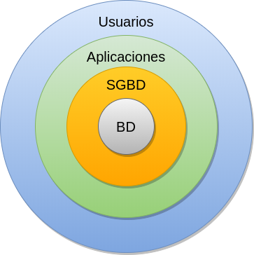
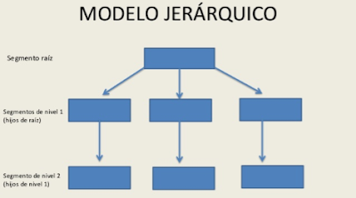
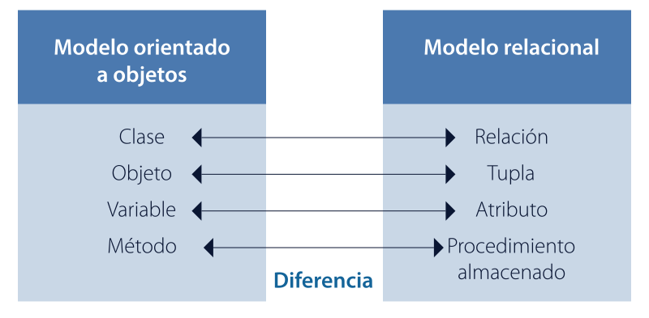
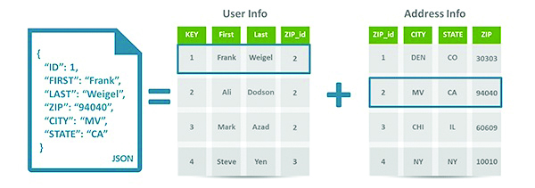

# **Introducción a las bases de datos**

### **Fundamentos de Base de Datos**

---

## **¿Qué es una base de datos?**

* Una base de datos es un conjunto organizado de datos que se almacenan y gestionan de manera eficiente.

---

**Objetivo principal**: Permitir el almacenamiento, recuperación y manipulación de datos de forma rápida y segura.

* **Ejemplos**:
  * Base de datos de una biblioteca (libros, usuarios, préstamos).
  * Base de datos de una tienda en línea (productos, clientes, pedidos).

---

## **Objetivos de las bases de datos**

**Integridad**: Garantizar que los datos sean precisos y consistentes.

**Disponibilidad**: Asegurar que los datos estén accesibles cuando se necesiten.

---
**Confidencialidad**: Proteger los datos de accesos no autorizados.

**Eficiencia**: Optimizar el almacenamiento y la recuperación de datos.

---

## **Modelos de bases de datos**

* **Modelo jerárquico**: Los datos se organizan en una estructura de árbol (padre-hijo).
* **Modelo relacional**: Los datos se organizan en tablas (filas y columnas).
* **Modelo orientado a objetos**: Los datos se representan como objetos, similares a la programación orientada a objetos.
* **Modelo NoSQL**: Bases de datos no relacionales, diseñadas para grandes volúmenes de datos no estructurados.

---

## **Modelo Jerárquico**

* Los datos se organizan en una estructura de árbol (padre-hijo).
* Cada nodo tiene un único padre y múltiples hijos.
* Ejemplo: Organización de carpetas en un sistema operativo.

---

## **Modelo Relacional**

* Los datos se organizan en tablas con filas y columnas.
* Usa claves primarias y foráneas para establecer relaciones.
* Ejemplo: Un sistema de gestión de empleados con tablas de empleados y departamentos.
  

---

## **Modelo Orientado a Objetos**

* Representa datos como objetos, similares a la programación orientada a objetos.
* Incluye herencia, encapsulación y polimorfismo.
* Ejemplo: Un sistema de gestión de productos con clases de productos y variantes.

---

---

## **Los manejadores de bases de datos orientados a objetos deben tomar en cuenta las siguientes operaciones:**

* Ser capaces de definir sus propios tipos de datos.
* El tamaño de los datos puede ser muy grande.
* La duración de las transacciones puede ser muy larga.
* Recuperar rápidamente objetos complejos.

---

* Lenguajes de consulta de objetos, un ejemplo es OQL (Object Query Language).
* Mecanismos de seguridad basados en la noción de objeto.
* Funciones para definir reglas deductivas.

---

## **Modelo NoSQL**

---

* Bases de datos no relacionales, diseñadas para grandes volúmenes de datos no estructurados.
* Ejemplo: Bases de datos de documentos como MongoDB.
* Tipos: Documentales, clave-valor, columnares y grafos.

---

## **Arquitectura de un sistema de bases de datos**

Un sistema de bases de datos se organiza en diferentes niveles de abstracción para garantizar una gestión eficiente y segura de los datos. Estos niveles permiten a los usuarios interactuar con la base de datos sin preocuparse por los detalles técnicos de su almacenamiento.

---

## Niveles de Abstracción

Existen tres niveles de abstracción en la arquitectura de un sistema de bases de datos:

1. **Nivel Interno**
2. **Nivel Conceptual**
3. **Nivel Externo**

---

---

Cada uno de estos niveles cumple un propósito específico y se encarga de diferentes aspectos del almacenamiento y uso de los datos.

---

## Nivel Interno

🔹 Se encarga de la representación física de los datos en el almacenamiento.  
🔹 Define la organización de archivos y estructuras de almacenamiento.  
🔹 Optimiza el acceso y recuperación de la información.  
🔹 Ejemplo: Índices, páginas de disco, estructuras de almacenamiento B-Trees.

---

## Nivel Conceptual

🔹 Describe la estructura lógica de la base de datos.  
🔹 Define las relaciones entre los datos y restricciones de integridad.  
🔹 No depende de cómo se almacenan físicamente los datos.  
🔹 Ejemplo: Modelo relacional con tablas, claves primarias y foráneas.

---

## Nivel Externo

🔹 Representa la forma en que los usuarios finales interactúan con los datos.  
🔹 Permite definir diferentes vistas de la base de datos según los permisos y necesidades de los usuarios.  
🔹 Facilita la seguridad y control de acceso a la información.  
🔹 Ejemplo: Vista personalizada para un usuario con acceso restringido a ciertas columnas.

---

* **Componentes clave**:
  * **SGBD (Sistema Gestor de Bases de Datos)**: Software que gestiona la base de datos.
  * **Lenguajes de consulta**: SQL (Structured Query Language) para manipular datos.

---

# **Clasificación de las Bases de Datos**

---

### Según su Contenido

🔹 **Bases de datos transaccionales (OLTP)**: Optimizadas para manejar operaciones frecuentes y rápidas, como ventas y registros de usuarios.  

🔹 **Bases de datos analíticas (OLAP)**: Diseñadas para consultas complejas y análisis de grandes volúmenes de datos, como reportes empresariales.

---

## Ejemplos de OLTP y OLAP

---

### OLTP (Procesamiento de Transacciones en Línea)

🔹 **Sistemas bancarios**: Transferencias, retiros y depósitos en tiempo real.  
🔹 **E-commerce**: Registro de compras, actualización de inventarios.  
🔹 **Sistemas de reservas**: Boletos de avión, hoteles.  
🔹 **Sistemas de gestión hospitalaria**: Registro de pacientes y consultas médicas.

----

### OLAP (Procesamiento Analítico en Línea)

🔹 **Reportes financieros**: Análisis de tendencias de ingresos y gastos.  
🔹 **Inteligencia de negocios**: Evaluación del rendimiento de productos y mercados.  
🔹 **Análisis de datos en telecomunicaciones**: Estudio de patrones de uso y facturación.  
🔹 **Análisis de marketing**: Segmentación de clientes y comportamiento de compra.

---

## Según su Ubicación

🔹 **Bases de datos centralizadas**: Toda la información se almacena en un único servidor o ubicación física.

🔹 **Bases de datos distribuidas**: La información se divide y replica en múltiples servidores geográficamente dispersos para mejorar la disponibilidad y redundancia.

---

## **Arquitectura de un SGBD**

### **Módulos principales**

---

### **Gestor de Almacenamiento:**

* Función: Es el encargado de administrar el almacenamiento físico de los datos en el disco.

* Responsabilidades:
  * Organización de los datos en archivos y estructuras de almacenamiento.
  * Gestión del espacio en disco y asignación de recursos.
  * Implementación de técnicas de acceso a los datos (índices, hashing, etc.).

---

* Manejo de la E/S de datos (lectura y escritura).

---

* Procesador de Consultas:
  * Función: Interpreta y ejecuta las consultas que realizan los usuarios para acceder a los datos.
  * Proceso:
    * Análisis: Examina la consulta para verificar su sintaxis y validez.
    * Optimización: Determina la estrategia más eficiente para ejecutar la consulta.
    * Ejecución: Lleva a cabo la consulta, recuperando los datos solicitados.

---

* Gestor de Transacciones:
  * Función: Garantiza la consistencia e integridad de los datos durante las operaciones, especialmente en entornos multiusuario.
  * Mecanismos:
    * Control de concurrencia: Evita conflictos entre transacciones que acceden a los mismos datos.
    * Manejo de errores y fallos: Asegura que las transacciones se completen correctamente o se reviertan en caso de error.

---

* Propiedades ACID: Cumplimiento de las propiedades de Atomicidad, Consistencia, Aislamiento y Durabilidad de las transacciones.
  
---

## **Interfaces**

* Interfaz de Usuario:
  * Propósito: Permite a los usuarios interactuar con la base de datos.
  * Tipos:
    * Interfaz gráfica (GUI): Proporciona herramientas visuales para crear, modificar y consultar datos.
    * Interfaz de línea de comandos (CLI): Permite interactuar mediante comandos de texto.
  
---

* Lenguajes de consulta (SQL): Lenguajes especializados para realizar consultas complejas.
* API (Interfaz de Programación de Aplicaciones):

* Función: Permite que otras aplicaciones se conecten e interactúen con la base de datos.
* Estándares:*
  * ODBC (Open Database Connectivity): Estándar para conectar aplicaciones a diversas bases de datos.
  * JDBC (Java Database Connectivity): API para conectar aplicaciones Java a bases de datos.

---  

## Componentes Adicionales

Además de los módulos e interfaces principales, un SGBD puede incluir otros componentes:

Diccionario de Datos: Almacena metadatos sobre la estructura de la base de datos (tablas, columnas, tipos de datos, etc.).

---

Herramientas de Administración: Facilitan la gestión y configuración del SGBD (copias de seguridad, monitorización, etc.).

Módulos de Seguridad: Controlan el acceso a la base de datos y protegen los datos de accesos no autorizados.

---

## Ventajas de usar bases de datos

1. **Reducción de redundancia**: Evita la duplicación de datos.
2. **Consistencia**: Mantiene los datos actualizados y precisos.
3. **Seguridad**: Control de acceso y protección de datos.
4. **Escalabilidad**: Capacidad para manejar grandes volúmenes de datos.
5. **Facilidad de acceso**: Consultas rápidas y eficientes.

---

## Desafíos de las bases de datos

* **Complejidad**: Diseñar y mantener una base de datos puede ser complicado.
* **Costo**: Requiere inversión en hardware, software y personal capacitado.
* **Seguridad**: Proteger los datos contra accesos no autorizados y ataques.
* **Rendimiento**: Optimizar el acceso a los datos en sistemas grandes.

---

## Resumen

* Una base de datos es un sistema organizado para almacenar y gestionar datos.
* Los modelos de bases de datos incluyen el relacional, jerárquico, orientado a objetos y NoSQL.
* La arquitectura de un SGBD consta de niveles de abstracción y módulos clave.
* Las bases de datos ofrecen ventajas como integridad, disponibilidad y seguridad, pero también presentan desafíos.

