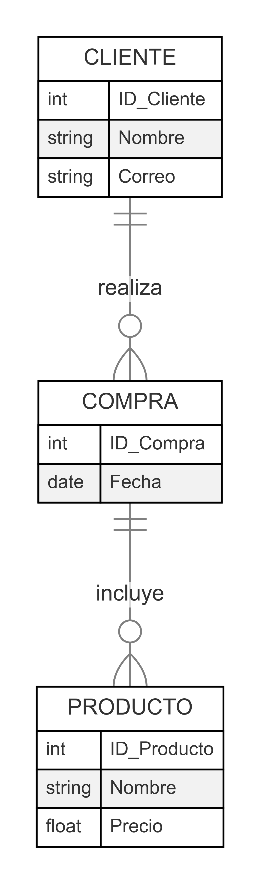
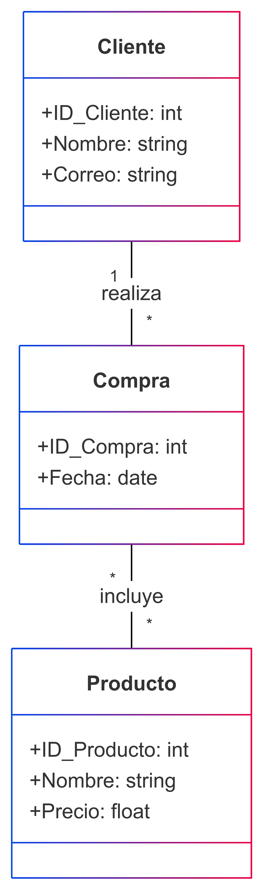

# **Diseño de Bases de Datos con el Modelo E-R**

---

## **El Proceso de Diseño**

### **¿Qué es el diseño de bases de datos?**
El diseño de bases de datos es el proceso de estructurar y organizar los datos para que sean almacenados de manera eficiente, asegurando su integridad y optimizando su acceso.

### **Fases del diseño de bases de datos:**
1. **Análisis de requerimientos:** Definir los datos y necesidades del sistema.
2. **Diseño conceptual:** Uso del modelo Entidad-Relación (E-R) para representar datos.
3. **Diseño lógico:** Transformación del diagrama E-R en tablas relacionales.
4. **Diseño físico:** Implementación en un sistema de gestión de bases de datos (DBMS).

---

## ** Modelo Entidad-Relación**

### **¿Qué es el modelo E-R?**
El modelo Entidad-Relación es una herramienta conceptual para modelar datos, utilizando entidades, atributos y relaciones entre ellas.

### **Elementos del modelo E-R:**
- **Entidades:** Representan objetos del mundo real (Ejemplo: `Cliente`, `Producto`).
- **Atributos:** Características de las entidades (Ejemplo: `Nombre`, `Precio`).
- **Relaciones:** Conexiones entre entidades (Ejemplo: `Compra` relaciona `Cliente` con `Producto`).

---

## ** Diseño con diagramas E-R**

### **¿Cómo se construye un diagrama E-R?**

1. **Identificar las entidades del sistema:**
   - Analizar el dominio del problema y listar los objetos principales que se gestionarán.
   - Ejemplo: En un sistema de ventas, las entidades podrían ser `Cliente`, `Producto`, `Pedido`.

---

2. **Definir atributos clave para cada entidad:**
   - Identificar las características más relevantes de cada entidad.
   - Tipos de atributos:
     - **Simples:** No se pueden dividir (Ejemplo: `Nombre` de un cliente).
     - **Compuestos:** Pueden descomponerse en partes más pequeñas (Ejemplo: `Dirección` con calle, ciudad, país).
     - **Multivaluados:** Una entidad puede tener varios valores para un mismo atributo (Ejemplo: `Teléfono` de un cliente).

---

3. **Establecer relaciones entre entidades:**
   - Definir cómo interactúan las entidades entre sí.
   - Tipos de relaciones:
     - **Uno a Uno (1:1):** Un usuario tiene una única cuenta bancaria.
     - **Uno a Muchos (1:M):** Un cliente puede realizar múltiples compras.
     - **Muchos a Muchos (M:M):** Un estudiante puede estar inscrito en varios cursos, y un curso puede tener varios estudiantes.
   - Incluir cardinalidad en las relaciones (mínimo y máximo de ocurrencias permitidas).

---

4. **Elegir claves primarias para identificación única:**
   - La clave primaria debe ser única para cada entidad.
   - Tipos de claves:
     - **Clave primaria simple:** Un solo atributo que identifica de forma única una entidad (Ejemplo: `ID_Cliente`).
     - **Clave primaria compuesta:** Se forma con dos o más atributos cuando no hay un solo atributo único (Ejemplo: `ID_Orden + ID_Producto` en una tabla de detalles de órdenes).

---

5. **Refinar el diseño para optimizar la estructura:**
   - Aplicar reglas de normalización para evitar redundancia de datos y mejorar eficiencia.
   - Revisar dependencias funcionales y dividir tablas si es necesario.
   - Evaluar índices y restricciones para mejorar consultas y garantizar integridad referencial.

---

### **Ejemplo de diagrama E-R:**

---

## **2.5 La Notación E-R con UML**

### **¿Cómo se usa UML para modelar bases de datos?**
UML (Unified Modeling Language) es un estándar para modelado de software que también puede representar bases de datos mediante diagramas de clases.

### **Diferencias entre UML y E-R:**
- UML usa **clases** en lugar de entidades.
- Representa **asociaciones** en lugar de relaciones.
- Define **multiplicidades** en lugar de cardinalidades.

---

### **Ejemplo de notación UML para bases de datos:**

---

## **Conclusión**

- El modelo E-R es fundamental para diseñar bases de datos estructuradas y eficientes.
- El diseño con diagramas E-R ayuda a visualizar la estructura de los datos.
- La extensión E-R y UML permiten modelar escenarios más complejos.