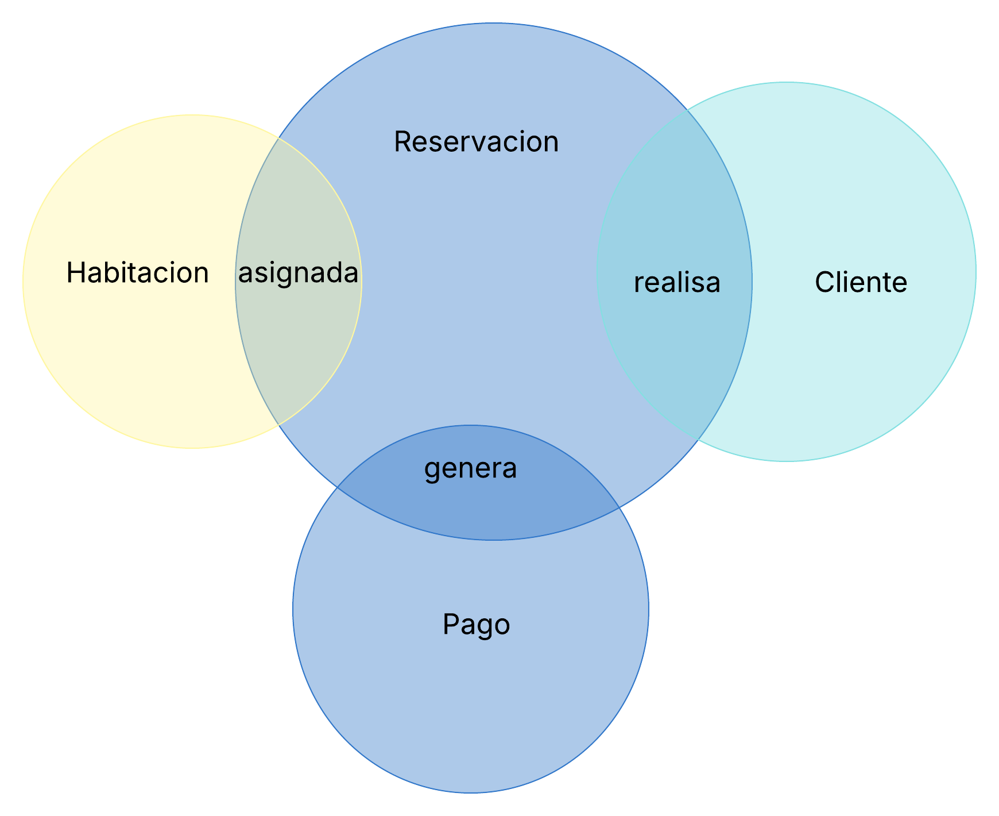
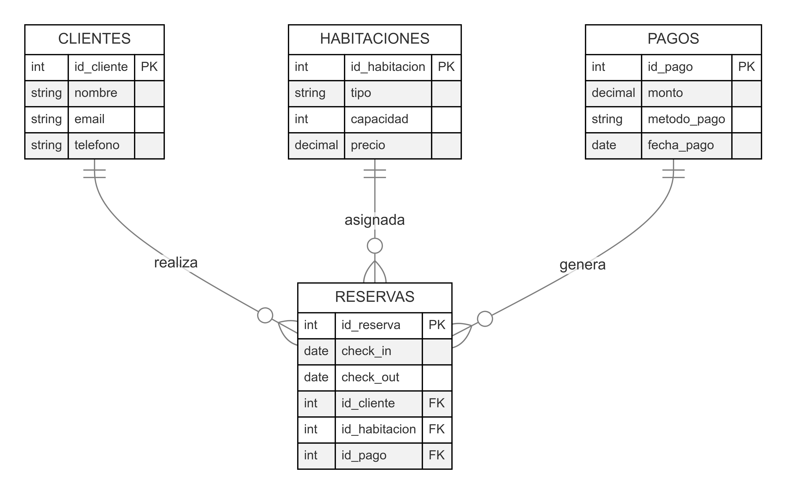

# **Diagrama Modelo Entidad-Relación para un Sistema de Reservas de Hotel**

---

## 📌 Requerimientos:

Los clientes deben poder reservar habitaciones.
Cada reserva debe registrar fechas de check-in y check-out.
Se debe almacenar información del cliente y del pago.
✅ Prácticas a aplicar:

Identificar entidades: Clientes, Reservas, Habitaciones, Pagos.
Definir reglas de negocio: No permitir dos reservas para la misma habitación en la misma fecha.
Aplicar normalización para evitar redundancia en los datos de los clientes.


---

## **1. Identificar las entidades del sistema**

Para modelar un sistema de reservas de hotel, identificamos las siguientes entidades principales:

- **Cliente**: Representa a la persona que realiza la reserva.
- **Habitación**: Representa las habitaciones disponibles en el hotel.
- **Reserva**: Registra las reservas realizadas por los clientes.
- **Pago**: Almacena la información de los pagos realizados por los clientes.

---

## **2. Definir atributos clave para cada entidad**

Cada entidad tiene atributos esenciales para la identificación y gestión del sistema:

- **Cliente**: `ID_Cliente` (PK), `Nombre`, `Correo`, `Teléfono`
- **Habitación**: `ID_Habitación` (PK), `Número`, `Tipo`, `Precio`
- **Reserva**: `ID_Reserva` (PK), `ID_Cliente` (FK), `ID_Habitación` (FK), `Fecha_CheckIn`, `Fecha_CheckOut`
- **Pago**: `ID_Pago` (PK), `ID_Reserva` (FK), `Monto`, `Método_Pago`, `Fecha_Pago`

---

## **3. Establecer relaciones entre entidades**

Las entidades se relacionan de la siguiente manera:

- Un **Cliente** puede realizar múltiples **Reservas**.
- Cada **Reserva** está asociada a una única **Habitación**.
- Cada **Reserva** puede generar un **Pago**.
- Una **Habitación** puede estar en múltiples **Reservas**, pero no en la misma fecha.

---

## **4. Elegir claves primarias para identificación única**

Para garantizar la unicidad de cada registro, se definen claves primarias:

- `ID_Cliente` como clave primaria de **Cliente**.
- `ID_Habitación` como clave primaria de **Habitación**.
- `ID_Reserva` como clave primaria de **Reserva**.
- `ID_Pago` como clave primaria de **Pago**.

Las claves foráneas (`ID_Cliente`, `ID_Habitación`, `ID_Reserva`) garantizan la integridad referencial entre las entidades.

---

## **5. Refinar el diseño para optimizar la estructura**

Para optimizar el diseño del sistema:

- **Normalización**: Se separan los datos en entidades bien definidas para evitar redundancia, asegurando que los clientes no se dupliquen en cada reserva.
- **Reglas de negocio**: Se establece una restricción para evitar que una habitación tenga dos reservas en la misma fecha.
- **Índices**: Se pueden crear índices en `ID_Habitación` y `Fecha_CheckIn/Fecha_CheckOut` para mejorar la velocidad de consulta.

---

## **6. Diagrama de Venn**



---

## **7. Diagrama de Modelo E-R**



---

## **8. Creación de la Base de Datos en PostgreSQL**

### **Tablas y relaciones**

```sql
CREATE TABLE Cliente (
    ID_Cliente SERIAL PRIMARY KEY,
    Nombre VARCHAR(100) NOT NULL,
    Correo VARCHAR(100) UNIQUE NOT NULL,
    Teléfono VARCHAR(15)
);

CREATE TABLE Habitacion (
    ID_Habitación SERIAL PRIMARY KEY,
    Número INT UNIQUE NOT NULL,
    Tipo VARCHAR(50) NOT NULL,
    Precio DECIMAL(10,2) NOT NULL
);
```

---

```sql
CREATE TABLE Reserva (
    ID_Reserva SERIAL PRIMARY KEY,
    ID_Cliente INT REFERENCES Cliente(ID_Cliente) ON DELETE CASCADE,
    ID_Habitación INT REFERENCES Habitacion(ID_Habitación) ON DELETE CASCADE,
    Fecha_CheckIn DATE NOT NULL,
    Fecha_CheckOut DATE NOT NULL,
    CONSTRAINT reserva_unica UNIQUE (ID_Habitación, Fecha_CheckIn, Fecha_CheckOut)
);

CREATE TABLE Pago (
    ID_Pago SERIAL PRIMARY KEY,
    ID_Reserva INT REFERENCES Reserva(ID_Reserva) ON DELETE CASCADE,
    Monto DECIMAL(10,2) NOT NULL,
    Método_Pago VARCHAR(50) NOT NULL,
    Fecha_Pago TIMESTAMP DEFAULT CURRENT_TIMESTAMP
);
```

---

## **9. Creación de Índices y su Justificación**

### **Índices para mejorar rendimiento**

```sql
CREATE INDEX idx_cliente_correo ON Cliente(Correo);
CREATE INDEX idx_habitacion_numero ON Habitacion(Numero);
CREATE INDEX idx_reserva_fechas ON Reserva(Fecha_CheckIn, Fecha_CheckOut);
```

### **Explicación de los Índices:**

- **`idx_cliente_correo`**: Acelera la búsqueda de clientes por correo, útil para autenticación y contacto.
- **`idx_habitacion_numero`**: Mejora la eficiencia en consultas de habitaciones por número.
- **`idx_reserva_fechas`**: Permite búsquedas rápidas en reservas por rango de fechas, reduciendo el tiempo de procesamiento.

---

## **Conclusión**

Este modelo E-R garantiza un diseño eficiente y estructurado del sistema de reservas de hotel, asegurando la integridad de los datos y optimizando su almacenamiento y gestión. La implementación en PostgreSQL junto con la indexación adecuada mejora el rendimiento y la escalabilidad del sistema.
