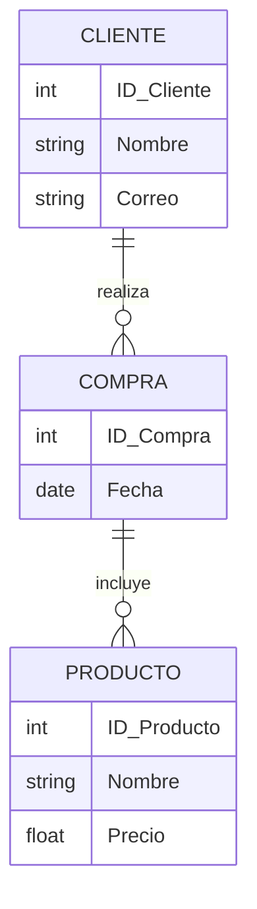

# **Diagrama Modelo Entidad-Relación (ER)**

---

## **¿Qué es un diagrama ER?**

- Es una representación gráfica de los datos en un sistema.
- Define entidades, relaciones y atributos.
- Se usa en el diseño de bases de datos.

---

## **Componentes del modelo ER**

### **1. Entidades**

- Representan objetos del mundo real.
- Ejemplo: `Cliente`, `Producto`, `Empleado`.

### **2. Atributos**

- Propiedades de una entidad.
- Ejemplo: `Nombre`, `Edad`, `Precio`.

---

### **3. Clave primaria**

- Un identificador único para una entidad.
- Ejemplo: `ID_Cliente`.

### **4. Relaciones**

- Enlazan entidades entre sí.
- Ejemplo: `Compra` relaciona `Cliente` con `Producto`.

---

## **Tipos de relaciones**

### **1. Uno a Uno (1:1)**

- Un cliente tiene una cuenta bancaria única.

### **2. Uno a Muchos (1:M)**

- Un cliente puede hacer muchas compras.

### **3. Muchos a Muchos (M:M)**

- Un estudiante puede estar en múltiples cursos y un curso puede tener varios estudiantes.

---

## **Ejemplo de diagrama ER**

---

## **Pasos para crear un diagrama ER**

1. **Identificar las entidades** del sistema.
2. **Definir atributos** clave para cada entidad.
3. **Establecer relaciones** entre entidades.
4. **Elegir claves primarias** para identificación única.
5. **Refinar el diseño** para optimizar la estructura.

---

## **Beneficios del diagrama ER**

- Facilita la comprensión del modelo de datos.
- Ayuda en el diseño eficiente de bases de datos.
- Reduce la redundancia de datos.

---

## **Conclusión**

- El diagrama ER es una herramienta clave en el modelado de datos.
- Permite visualizar la estructura y relaciones en un sistema.
- Es la base para un diseño de base de datos bien estructurado.
